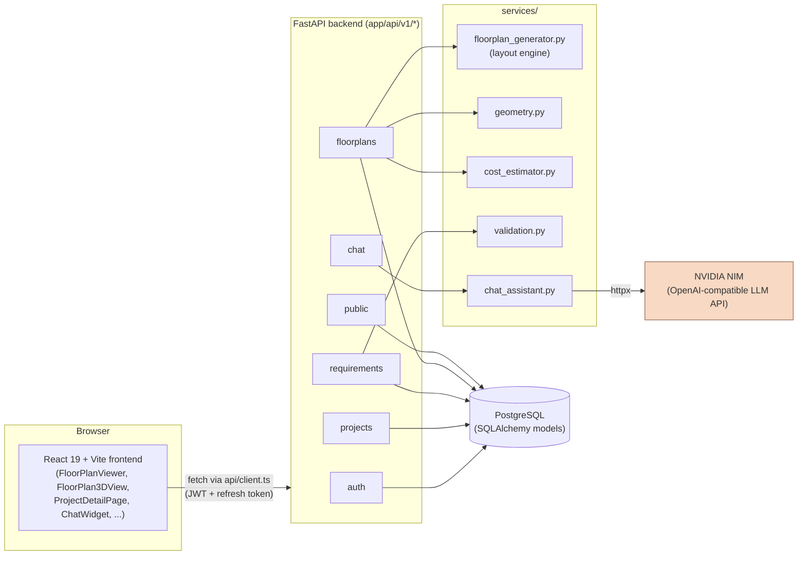
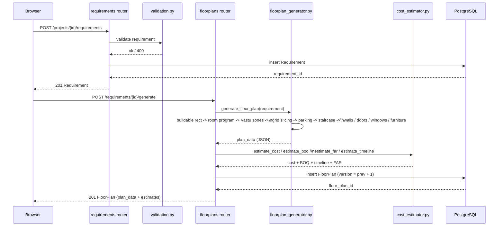
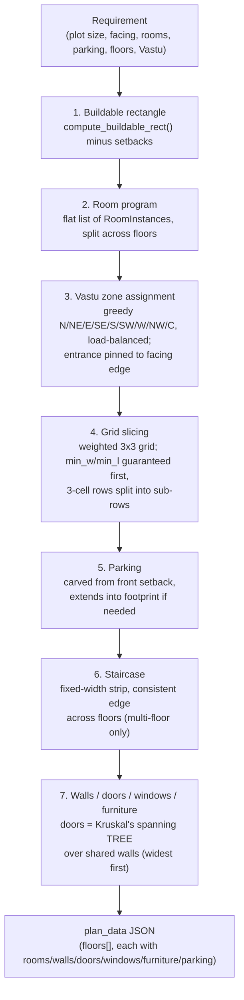
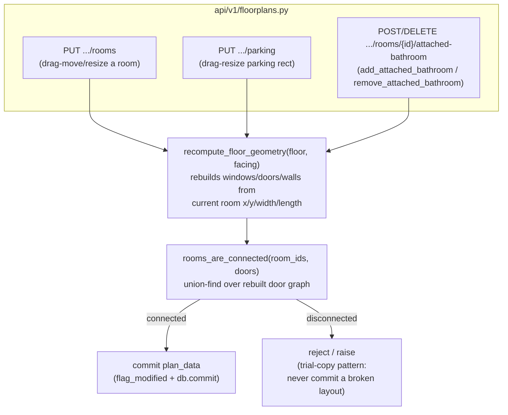
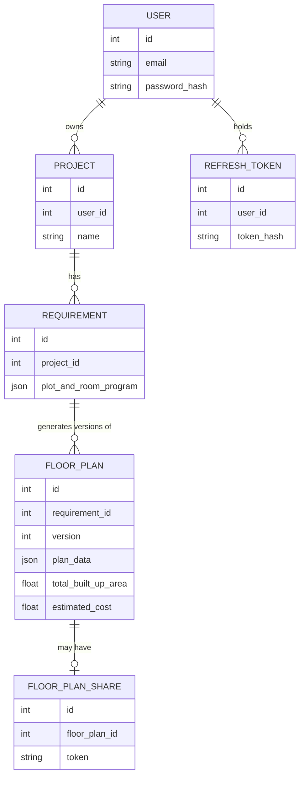
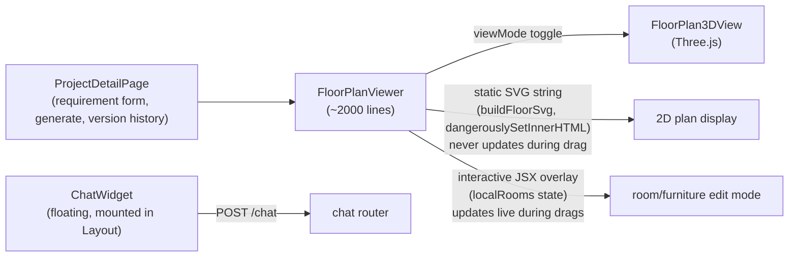

# Architecture

Visual companion to `CLAUDE.md` — that file has the prose detail (routes,
invariants, gotchas); this one is diagrams of how the pieces fit together
and how a request actually flows through the system. Open in VS Code with
the "Markdown Preview Mermaid Support" extension (or view on GitHub) to
render the diagrams.

## 1. System overview

Two independent apps talking over a REST API, plus one external AI call.

**Only one external AI call in the whole app**: the chat assistant. Floor
plan generation, cost/BOQ estimation, and every manual edit (drag-resize,
attach-bathroom, parking resize) are pure geometry/rule-based code — no LLM
involved.

## 2. Generate-a-floor-plan request flow

What happens end to end when a user fills the requirement form and clicks
"Generate".

Regenerating never overwrites a plan — it inserts a new `FloorPlan` row
with `version = previous + 1`, so plan history per project is preserved.

## 3. Inside the layout engine (`generate_floor_plan`)

The seven-step pipeline that turns a `Requirement` into `plan_data`,
per floor.

**Known simplification**: every floor shares the same footprint, except
"independent-floor duplex mode" which lets floors diverge.

## 4. Manual post-generation edits

Three endpoints mutate `plan_data` in place instead of regenerating from
scratch — all funnel through the same two functions, reusing the exact
derivation the generator itself uses so a hand-edited layout keeps the same
connectivity guarantees.

Two geometry invariants make this safe — see
`.claude/rules/room-geometry.md` for the full writeup:

- A rect can only be split along a **full edge** (never a corner notch —
  the room model has no polygon support).
- Rebuilding from **already-rounded, stored** rects needs a larger touch
  tolerance (`0.05`) than the strict tolerance the initial generation pass
  uses, or rounding slivers silently disconnect rooms.

## 5. Data model

Every model mixes in `AuditMixin` (`created_at` / `updated_at` /
`deleted_at` / `deleted_by` / `is_active`) — **soft delete only**, rows are
flagged not physically removed. `FloorPlanShare.token` is stored in the
clear (it's a link meant to be shared); `RefreshToken.token_hash` stores
only a sha256 hash (it's a bearer secret).

## 6. Frontend view layer

Both `FloorPlanViewer` and `FloorPlan3DView` render from the same
`plan_data` prop — no separate 3D data model. `FloorPlan3DView` rebuilds
its Three.js scene procedurally on every relevant prop/state change
(plan, floor filter, roof toggle, furniture toggle).
